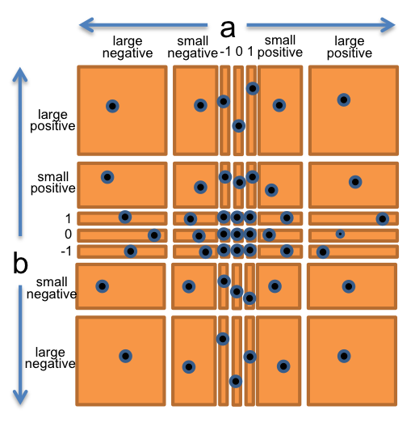
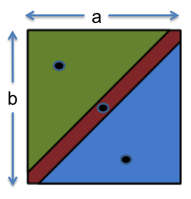

= 03. Testing

== Validation
* 테스트의 목적은 프로그램의 문제를 찾아내고 프로그램의 정확성에 대한 신뢰를 높이는 것.
** Formal reasoning (형식 추론) = verification (검증)
*** 검증은 그 프로그램이 정확하다는 형식적인 증명을 포함한다.
*** 검증은 수동으로 진행하기에는 지루하며 검증을 위한 자동화된 도구는 여전히 연구 분야이다.
*** 그럼에도 운영체제의 스케줄러나 virtual machine의 인터프리터, 운영체제의 파일시스템 같은 프로그램의 작고 중요한 조각들은 공식적으로 검증 될 수 있다.

** Code Review
*** 누군가가 내가 작성한 코드를 읽는 것은 비공식적으로 버그를 발견할 수 있는 좋은 방법이다.

** Testing
*** 특정한 입력에 대해서 프로그램을 실행해 결과를 확인하는 작업.

=== Why Software Testing is Hard
* 잘못된 접근방식
** Exhaustive testing
*** 철저한 테스트는 불가능하다.
*** 가능한 테스트 케이스의 크기가 너무 커서 모든 것을 다룰 수 없다.
*** 32비트 부동 소수점 곱셈 연산을 철저하게 테스트 한다는 것은 2^64개의 테스트 케이스를 모두 수행해야 한다는 뜻.

** Haphazard testing
*** 프로그램에 버그가 너무 많아서 선택한 입력이 성공하는것보다 실패할 확률이 더 높지 않은 이상
엉터리로 테스트를 수행하는 것은 버그를 찾아 낼 확률이 낮다.
*** 프로그램의 정확성에 대한 우리의 신뢰를 높일 수 없다.

** Random or statistical testing
*** 난수 또는 통계적 테스트는 소프트웨어에 적합하지 않다.
*** 소프트웨어 동작은 가능한 입력 공간에 따라서 불규칙적이다.
*** 스팩 오버플로, 메모리 부족, 숫자 오버플로 버그는 확률적으로 발생하는 것이 아니라 같은 방식으로 발생한다.

=== Putting on Your Testing Hat
* 코드를 작성할 때의 목표는 프로그램을 작동하게 만드는 것이지만, 테스터의 목표는 프로그램이 실패하도록 하는 것.

== Test-first Programming
1. 함수에 대한 스펙(specification)을 작성한다.
2. 그 스펙을 실행하는 테스트를 작성한다.
3. 실제 코드를 작성한다.

specification::
* 함수의 입력과 출력에 대한 설명.
* 매개변수의 타입과 추가적인 어떤 제약사항을 제공한다.
* 반환 값의 타입과 어떻게 입력과 관련이 있는지에 대한 설명도 제공한다.
* 코드에서 스펙은 메소드 시그니처와 그 메서드에 대한 주석으로 구성된다.

{empty}

* 테스트를 먼저 작성하는 것은 스펙을 이해하는 좋은 방법.
* 스펙은 오류가 많을 수 있고, 부적절하거나 부정확하고 애매모호하거나 일부 케이스를 잊을 수 있다.
* 테스트를 작성하려고 노력한다면 잘못된 스펙을 구현하는데에 시간낭비 하기전에 이런 문제들을 조기에 발견할 수 있다.

== Choosing Test Cases by Partitioning
1. 입력 공간을 각각의 입력 집합의 구성된 서브 도메인으로 나눈다.
2. 각각의 서브 도메인으로부터 하나의 테스트 케이스를 결정한다.

**Example : `BigIntger.multiply()`**
[source, java]
----
/**
* @param val another BigInteger
* @return a BigInteger whose value is (this * val).
*/
public BigInteger multiply(BigInteger val)
----

* input으로 생각해야 할 것 : this, val (multiply : BigInteger x BigInteger -> BigInteger)
* a, b 로 구성된 두 차원의 입력공간을 생각할 수 있다.
** a, b는 모두 양수이다.
** a, b는 모두 음수이다.
** a는 양수, b는 음수
** a는 음수, b는 양수

* 곱셈의 특별한 경우 ?
** a 또는 b가 0, 1, -1

* BigInteger의 구현을 빠르게 하기 위해 내부적으로 int 또는 long을 사용하지 않았는가 ?
** `Long.MAX_VALUE` 보다 더 큰 값을 가진 경우

* 이미지처럼 총 49개의 파티션으로 구분된다.
* 해당 파티션중 임의의 a, b 짝을 선택한다.

**Example : `max()`**
[source, java]
----
/**
* @param a  an argument
* @param b  another argument
* @return the larger of a and b.
*/
public static int max(int a, int b)
----
*  `max : int x int -> int`

* 해당 스펙으로부터 input에 대한 파티션을 생각해보자.
** a < b
** a > b
** a = b

* 특별한 경계값에 대한 입력
** a 의 값이
*** a = Integer.MIN_VALUE
*** a = Integer.MAX_VALUE

** b 의 값이
*** b = Integer.MIN_VALUE
*** b = Integer.MAX_VALUE

=== 극단적인 방법
==== Full Cartesian product
* BigInteger.multiply(), max()메서드의 경우 입력에 대한 테스트 케이스가 49개, 75개 등 이 존재하지만
모든 경우에 대해서 테스트를 시행할 수 없다.
* ex) max() 메서드의 a와 b의 관계가 a < b인데 두 값이 0, 0일 경우.

==== Cover each part.

== Blackbox and Whitebox Testing

Blackbox Testing::
* 기능 구현이 아닌 스펙에서 테스트 케이스를 선택한다.
* 함수에 대한 실제 코드 없이 결정한다.

Whitebox Testing::
* 함수가 실제로 어떻게 구현되는지에 대한 지식에서 테스트 케이스를 선택한다.
* 입력에 따라서 다른 알고리즘으로 구현된다면 해당 도메인에 따라서 파티션을 나누어야 한다.

whitebox testing을 진행할 때 스펙에서 특별한 요구가 존재하지 않는 특정 구현에 대한 테스트 케이스가 필요한지에 대한 고민이 필요하다.

== Documenting Your Testing Strategy
[source, java]
----
/**
 * Reverses the end of a string.
 *
 * For example:
 *   reverseEnd("Hello, world", 5)
 *   returns "Hellodlrow ,"
 *
 * With start == 0, reverses the entire text.
 * With start == text.length(), reverses nothing.
 *
 * @param text    non-null String that will have
 *                its end reversed
 * @param start   the index at which the
 *                remainder of the input is
 *                reversed, requires 0 <=
 *                start <= text.length()
 * @return input text with the substring from
 *               start to the end of the string
 *               reversed
 */
static String reverseEnd(String text, int start)
----

[source, java]
----
/*
 * Testing strategy
 *
 * Partition the inputs as follows:
 * text.length(): 0, 1, > 1
 * start:         0, 1, 1 < start < text.length(),
 *                text.length() - 1, text.length()
 * text.length()-start: 0, 1, even > 1, odd > 1
 *
 * Include even- and odd-length reversals because
 * only odd has a middle element that doesn't move.
 *
 * Exhaustive Cartesian coverage of partitions.
 */
----

[source, java]
----
// covers test.length() = 0,
//        start = 0 = text.length(),
//        text.length()-start = 0
@Test public void testEmpty() {
    assertEquals("", reverseEnd("", 0));
}

// ... other test cases ...
----

== Coverage
* test suite를 판단하는 방법은 해당 test suite가 프로그램에서 얼마나 철저하게 동작하는지 확인하는 것.

{empty}

Statement coverage::
test case가 모든 statement에서 실행하는가?

Branch coverage::
프로그램의 모든 if문이나 while문에서 true false에 대해서 모두 확인하는가?

Path coverage::
branch에 대한 모든 가능한 결합에 대한 test case를 가지는가?

{empty}

* path coverage > branch coverage > statement coverage

* 일반적인 테스팅에 대한 접근은 test suite가 적절한 statement coverage를 달성할 때 까지 (프로그램의 모든 statement가 최소한 하나의 test case에 의해서 실행될 때) 테스트를 추가하는 것.

== Unit Testing and Stubs

==== Unit Testing (단위 테스트)
개별 모듈을 테스트 하는 것.

* 특정 메서드를 테스트할 때 다른 메서드가 옳다는 것에 의존해서 코드를 작성하면 안된다.
* 테스트 코드가 제대로 동작하지 않을 때 어느 부분에서 문제가 발생했는 지 확인할 수 없음. (통합 테스트)

