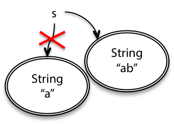
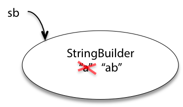

= https://ocw.mit.edu/ans7870/6/6.005/s16/classes/02-basic-java/[Reading 2: Basic Java]

> TOPIC : Java syntax and semantics

=== Software in 6.005
[cols=3, %autowitdh, options="header"]
|===
| Safe from bugs                          | Easy to understand | Ready for change
| 현재도 확인하고, 알 수 없는 미래도 확인하자!
| 내가 작성한 코드를 미래의 내가 봐도 알아볼 수 있고, 다른 사람도 알아볼 수 있도록 작성하자!
| 다시 작성하지 않고도 변경 사항을 수용할 수 있는 코드를 작성하자!
|===

=== Language basics
**[Variable]**

1. The term "instance variable" is another name for `non-static filed`.
2. The term "class variable" is another name for `static field`.
3. A local variable stores temporary state; it is declared inside a `method`.
4. A variable declared within the opening and closing parenthesis of a method signature is called a `parameter`.
5. What are the eight primitive types suppported by the Java Programming Language?
 -> byte short int long float double char boolean
6. Character strings are represented by the class `java.lang.String`.
7. An `array` is a container object that holds a fixed number of values of a single type.

[source,java]
----
public class test {

	int iv; // 인스턴스 변수
	static int cv; // 클래스 변수

	void method() {
		int lv; // 지역 변수
	}
}
----

{empty} +

**[Operators]**

1. Consider the following code snippet. +
    *_arrayOfInts[j] > arrayOfInts[j+1]_* +
Which operators does the code contain? -> `>` and `+`

2. Consider the following code snippet.
    int i = 10;
    int n = i++%5;

** What are the values of i and n after the code is executed?
** What are the final values of i and n if instead of using the postfix increment operator (i++)
** you use the prefix version (++i))? +

-> i = 11로 고정, n은 후위 연산자(i++)일 경우 0, 전위 연산자(++i)일 경우 1

3. To invert the value of a boolean, which operator would you use? -> `!`
4. Which operator is used to compare two values, = or == ? +
-> assignment(=)와 equal(==), 비교를 하기 위해서는 equal(==) 사용
5. Explain the following code sample: result = someCondition ? value1 입 value2; +
-> 삼항연산자로 someCondition이 true일 경우 result에 value1, false인 경우 value2를 대

{empty} +
**[Expressions, Statements, and Blocks]**

1. Operators may be used in building `expression`, which compute values.
2. Expressions are the core components of `statements`.
3. Statements may be grouped into `block`.
4. The following code snippet is an example of a `compound` expression. +
 1 * 2 * 3
5. Statements are roughly equivalent to sentences in natural languages, but instead of ending with a period, a statement ends with a `semicolon`.
6. A block is a group of zero or more statements between balanced `braces` and can be used anywhere a single statement is allowed.

{empty} +
**[Control Flow Statements]**

1. The most basic control flow statement supported by the Java programming language is the `if-then` statement.
2. The `switch` statement allows for any number of possible execution paths.
3. The `do-while` statement is similar to the while statement, but evaluates its expression at the `bottom` of the loop.
4. How do you write an infinite loop using the for statement? -> for ( ; ; )
5. How do you write an infinite loop using the while statement? -> while(true)

{empty} +
**[Numbers]**

*1) Use the API documentation to find the answers to the following questions:*
a. What Integer method can you use to convert an int into a string that expresses the number in hexadecimal? For example, what method converts the integer 65 into the string "41"?
-> Integer.toHexString(65)
b. What Integer method would you use to convert a string expressed in base 5 into the equivalent int? For example, how would you convert the string "230" into the integer value 65? Show the code you would use to accomplish this task.
-> Integer.parseInt("230", 5);
c. What Double method can you use to detect whether a floating-point number has the special value Not a Number (NaN)?
-> Double.isNaN()

*2) What is the value of the following expression, and why?*
** Integer.valueOf(1).equals(Long.valueOf(1))
-> false, eqauls에서는 object를 비교하기 때문에 서로 다른 클래스(Integer, Long)이므로 false를 반환한다.

{empty} +
**[Characters]**

**1. What is the initial capacity of the following string builder?**

[source,java]
----
String Builder sb = new StringBuilder("Able was I ere I saw Elba."); -> 26
----

**2. Consider the following string:**

[source,java]
----
_String hannah = "Did hannah see bees? Hannah did.";_

_a. What is the value displayed by the expression hanna.length()? - 32_ +
_b. What is the value returned by the method call hannah.charAt(1)? - e_ +
_c. Write an expression that refers to the letter b in the string referred to by hannah. - hannah.charAt(15);_ +
----

*3. How long is the string returned by the following expression? What is the string?* -> `car`

[source,java]
----
"Was it a car or a cat I saw?".substring(9, 12)
----

*4. In the following program, called ComputeResult, what is the value of result after each numbered line executes?*
[source, java]
----
public class ComputeResult {
    public static void main(String[] args){
      String original = "software";
      StringBuilder result = new StringBuilder("hi");
      int index = original.indexOf('a');

      result.setCharAt(0, original.charAt(0));                      // si
      result.setCharAt(1, original.charAt(original.length() - 1));  // se
      result.insert(1, original.charAt(4));                         //
      result.append(original.substring(1, 4));
      result.insert(3, (origianl.substring(index, index + 2) + " "));
    }
}
----

== Mutating values vs. reassigning variables

* `String` -> immutable type, 값을 변경하면 새로운 객체를 생성하고 그 객체를 참조
* `StringBuilder` -> mutable type, 값을 변경하면 기존 객체의 값을 변경

=== Immutable references

[source,java]
----
final int n = 5;
----
* 자바에서는 `final` 키워드를 사용하여 참조를 불변으로 만들 수 있음.
* 위와 같이 선언된 변수 n은 변경이 불가능함.

